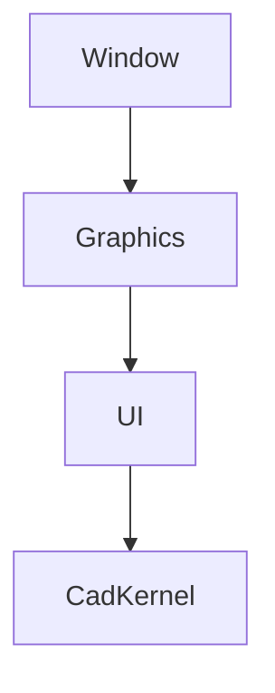

# コンポーネント間通信インターフェース定義書

## 1. 概要
本文書では、MVPにおける各コンポーネント間の通信インターフェースを定義します。

## 2. コンポーネント構成
### 2.1 主要コンポーネント
- Window コンポーネント
- Graphics コンポーネント
- UI コンポーネント
- CadKernel コンポーネント

### 2.2 コンポーネント間の依存関係


## 3. 通信インターフェース定義

### 3.1 Window ⇔ Graphics
#### データ構造
```rust
pub struct WindowHandle {
    pub window: winit::window::Window,
}

pub struct GraphicsContext {
    pub window_handle: WindowHandle,
}
```

#### メソッド
- `init_graphics(window_handle: WindowHandle) -> Result<GraphicsContext, Error>`
- `update_window_size(context: &mut GraphicsContext, width: u32, height: u32) -> Result<(), Error>`

### 3.2 Graphics ⇔ UI
#### データ構造
```rust
pub struct UiContext {
    pub graphics_context: GraphicsContext,
}

pub struct UiEvent {
    pub event_type: UiEventType,
    pub position: Option<(f32, f32)>,
    pub data: Option<String>,
}
```

#### メソッド
- `init_ui(graphics_context: GraphicsContext) -> Result<UiContext, Error>`
- `handle_ui_event(context: &mut UiContext, event: UiEvent) -> Result<(), Error>`

### 3.3 UI ⇔ CadKernel
#### データ構造
```rust
pub struct CadContext {
    pub ui_context: UiContext,
}

pub struct CadCommand {
    pub command_type: CadCommandType,
    pub parameters: Vec<String>,
}
```

#### メソッド
- `init_cad_kernel(ui_context: UiContext) -> Result<CadContext, Error>`
- `execute_cad_command(context: &mut CadContext, command: CadCommand) -> Result<(), Error>`

## 4. エラー処理
### 4.1 エラー型定義
```rust
#[derive(Debug)]
pub enum Error {
    WindowError(String),
    GraphicsError(String),
    UiError(String),
    CadError(String),
}
```

### 4.2 エラー伝播
- 各コンポーネントで発生したエラーは、適切な型に変換して上位コンポーネントに伝播
- エラーログは各レイヤーで適切に記録

## 5. 非同期処理
### 5.1 イベントループ
```rust
pub async fn run_event_loop(
    window_context: WindowContext,
    graphics_context: GraphicsContext,
    ui_context: UiContext,
    cad_context: CadContext,
) -> Result<(), Error> {
    loop {
        // イベント処理
        // 描画更新
        // CAD処理
    }
}
```

## 6. パフォーマンス考慮事項
- コンポーネント間の通信はできるだけバッチ処理
- 大きなデータの受け渡しは参照で行う
- メモリの��率的な利用のため、必要に応じてプーリングを実施

## 7. 拡張性
- 新しいコンポーネントの追加を考慮した設計
- インターフェースはトレイトで抽象化
- 将来的な機能追加に備えたバージョニング

## 8. セキュリティ考慮事項
- コンポーネント間の通信は信頼境界内
- 外部入力は適切にバリデーション
- エラーメッセージは適切にサニタイズ
``` 