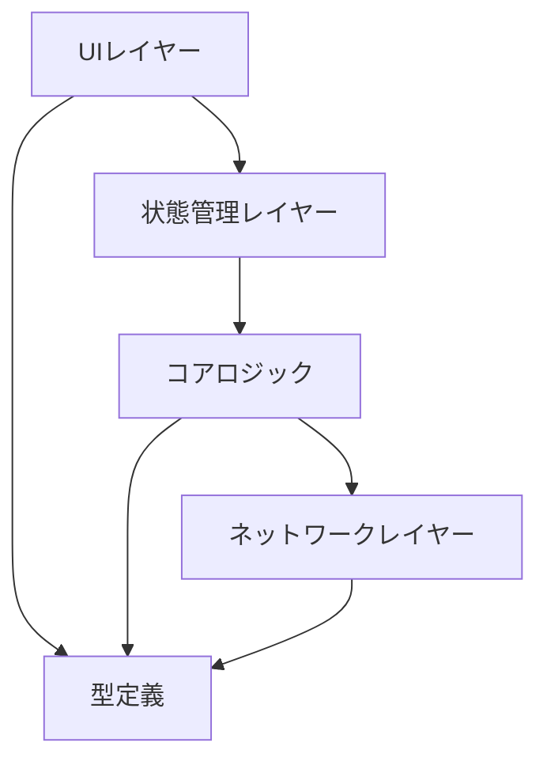
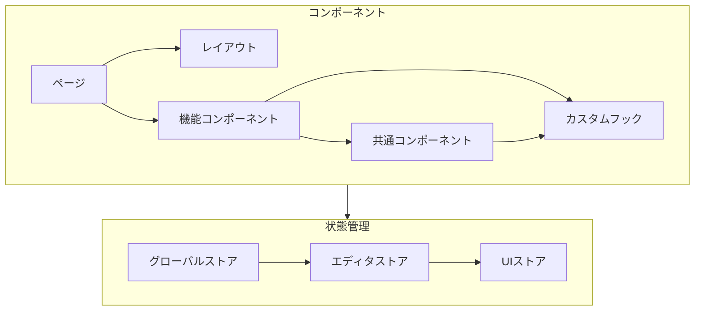
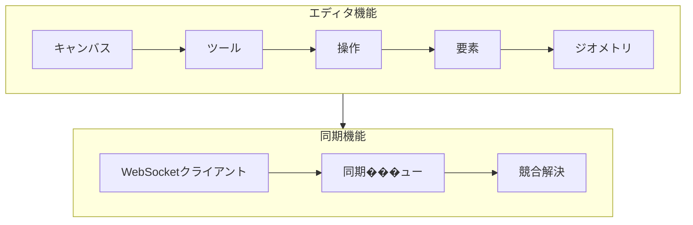
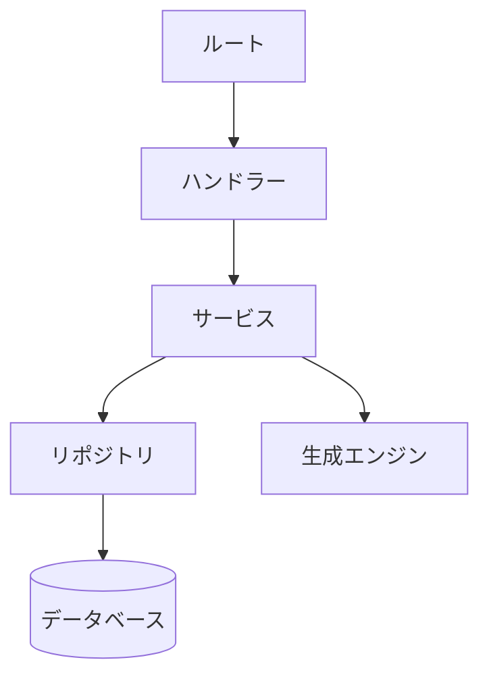
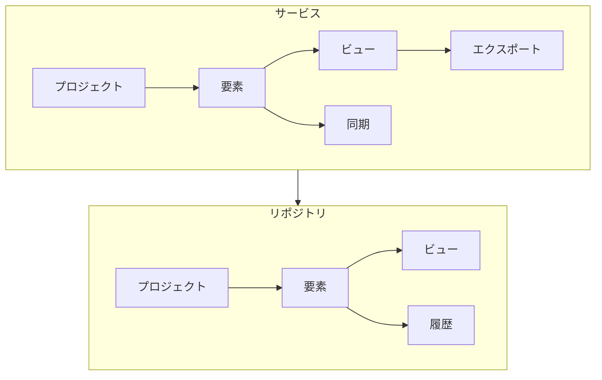
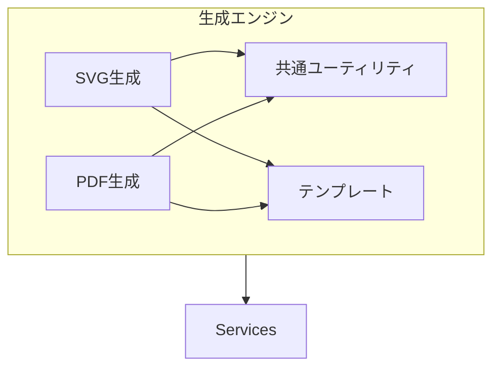
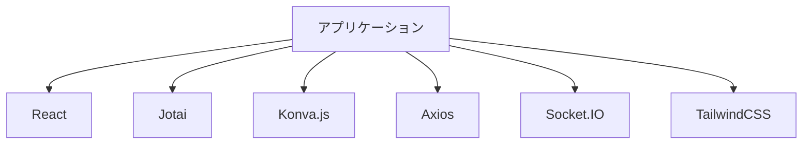
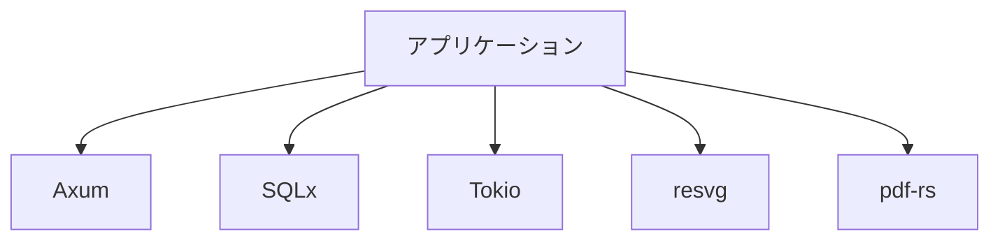

# 依存関係図

## 概要
RDDMシステムのモジュール間の依存関係の定義。

## フロントエンド依存関係

### 1. レイヤー構造


### 2. コンポーネント依存関係


### 3. 機能モジュール依存関係


## バックエンド依存関係

### 1. レイヤー構造


### 2. サービス依存関係


### 3. 生成エンジン依存関係


## 外部依存関係

### 1. フロントエンド


### 2. バックエンド


## パッケージ依存関係

### 1. フロントエンド
```json
{
  "dependencies": {
    "react": "^18.0.0",
    "react-dom": "^18.0.0",
    "jotai": "^2.0.0",
    "konva": "^9.0.0",
    "react-konva": "^18.0.0",
    "axios": "^1.0.0",
    "socket.io-client": "^4.0.0",
    "tailwindcss": "^3.0.0",
    "@types/react": "^18.0.0",
    "@types/react-dom": "^18.0.0",
    "typescript": "^5.0.0",
    "vite": "^5.0.0"
  },
  "devDependencies": {
    "eslint": "^8.0.0",
    "prettier": "^3.0.0",
    "jest": "^29.0.0",
    "@testing-library/react": "^14.0.0"
  }
}
```

### 2. バックエンド
```toml
[dependencies]
axum = "0.7"
tokio = { version = "1.0", features = ["full"] }
sqlx = { version = "0.7", features = ["sqlite", "runtime-tokio-native-tls"] }
serde = { version = "1.0", features = ["derive"] }
serde_json = "1.0"
resvg = "0.35"
pdf-rs = "0.4"
tower = "0.4"
tower-http = { version = "0.4", features = ["cors"] }
tracing = "0.1"
tracing-subscriber = "0.3"

[dev-dependencies]
tokio-test = "0.4"
mockall = "0.11"
```

## 循環依存の防止

### 1. 依存関係の方向
- 上位レイヤーから下位レイヤーへの一方向の依存
- 共通モジュールへの依存は許可
- ビジネスロジックは下位レイヤーに配置

### 2. インターフェース分離
```typescript
// 抽象化による依存関係の分離
interface ElementRepository {
    create(element: Element): Promise<void>;
    update(element: Element): Promise<void>;
    delete(id: string): Promise<void>;
}

class SQLiteElementRepository implements ElementRepository {
    // 実装
}
```

### 3. 依存性注入
```typescript
// サービスレベルでの依存性注入
class ElementService {
    constructor(
        private repository: ElementRepository,
        private syncService: SyncService
    ) {}
}
```

## バージョン管理

### 1. パッケージのバージョン固定
```json
{
  "dependencies": {
    "react": "18.2.0",
    "jotai": "2.4.3",
    "konva": "9.2.0"
  }
}
```

### 2. 互換性の確保
- メジャーバージョンの更新は慎重に判断
- セキュリティアッ��デートは優先的に適用
- 依存パッケージの更新は定期的にレビュー

## デプロイメント依存関係

### 1. 開発環境
```yaml
version: '3.8'
services:
  frontend:
    depends_on:
      - backend
    environment:
      - VITE_API_URL=http://localhost:8000
  
  backend:
    depends_on:
      - db
    environment:
      - DATABASE_URL=sqlite://data/rddm.db
  
  db:
    volumes:
      - ./data:/data
```

### 2. 本番環境
- フロントエンドはCDNにデプロイ
- バックエンドはコンテナオーケストレーション
- データベースは永続化ボリュームを使用
``` 