# データフロー図

## 概要
RDDMシステムのデータの流れとその処理の定義。

## システム全体のデータフロー

### 1. メインフロー
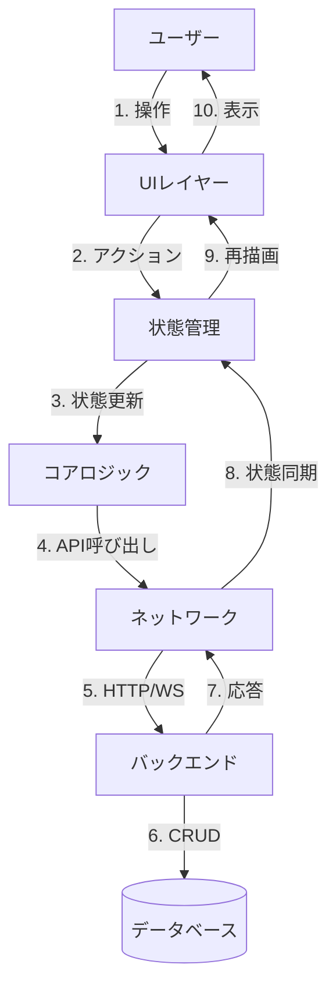

## 詳細フロー

### 1. 要素作成フロー
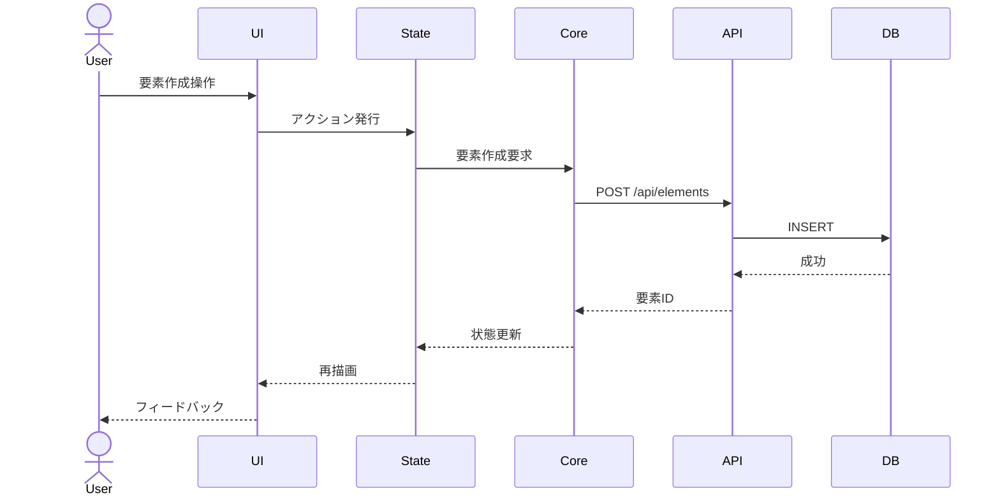

### 2. リアルタイム同期フロー
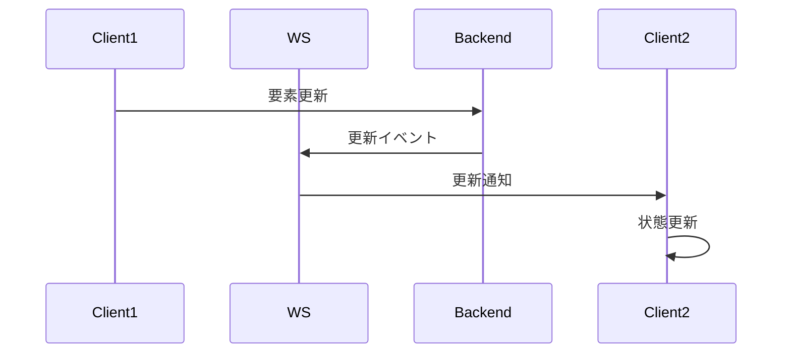

### 3. ビュー切替フロー
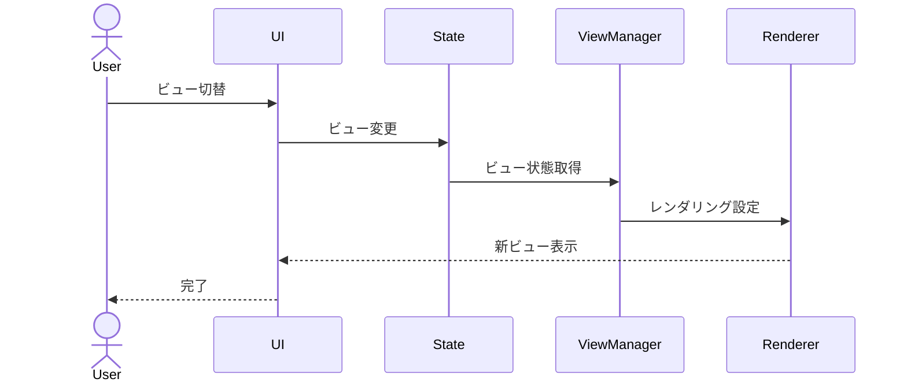

## データ変換フロー

### 1. 間取り図→構造図変換
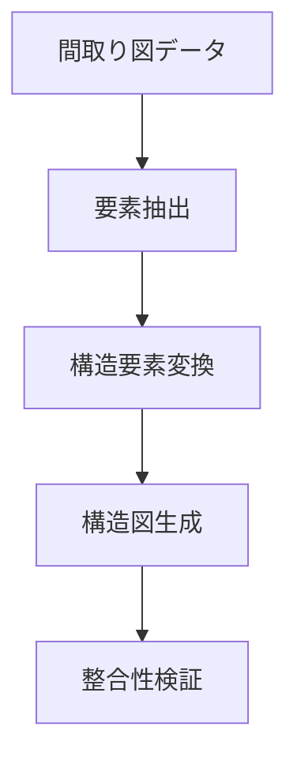

### 2. 構造図→意匠図変換
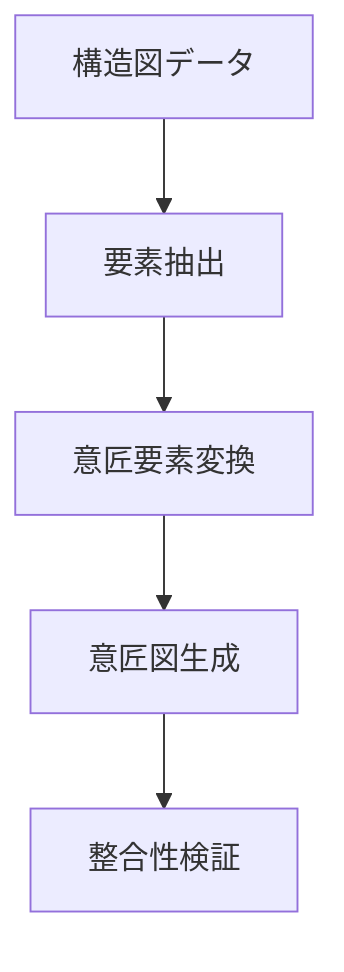

## 状態管理フロー

### 1. グローバル状態
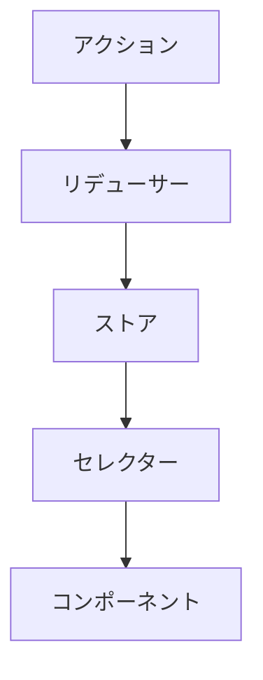

### 2. エディタ状態
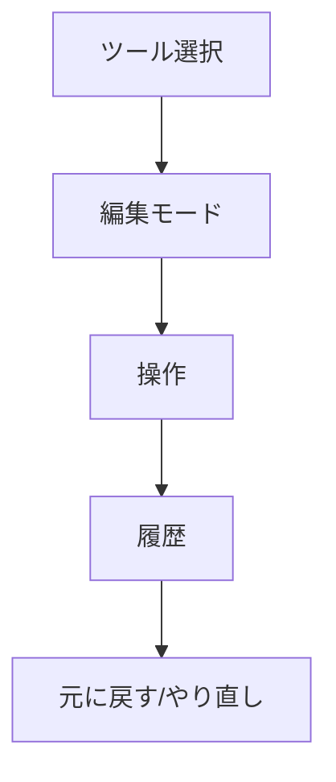

## データ永続化フロー

### 1. 保存フロー
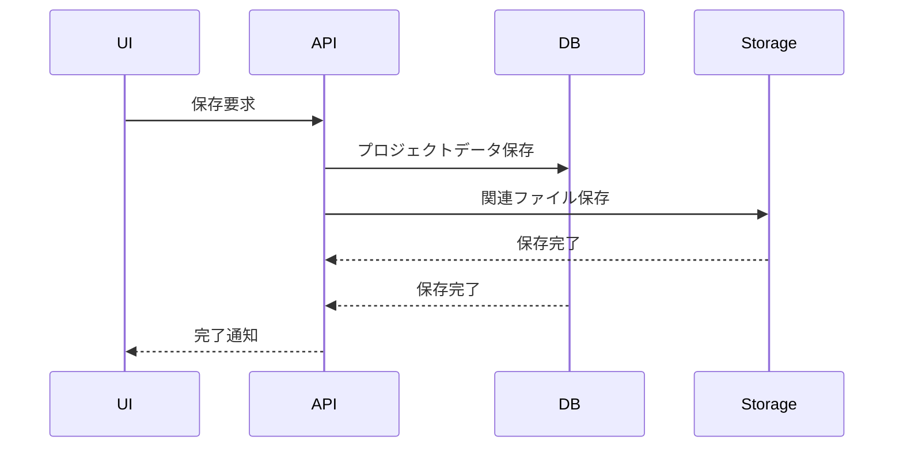

### 2. 読み込みフロー
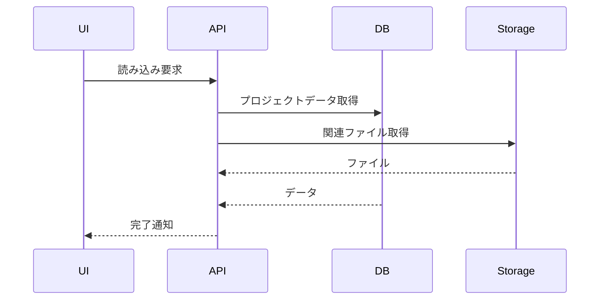

## エラーフロー

### 1. バリデーションエラー
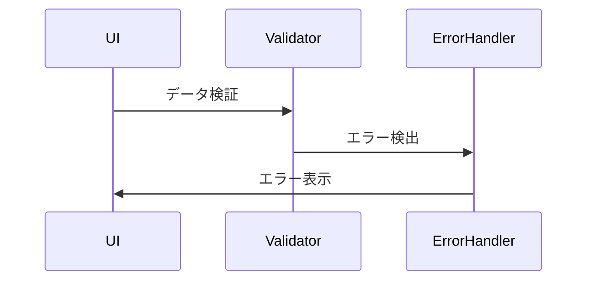

### 2. 同期エラー
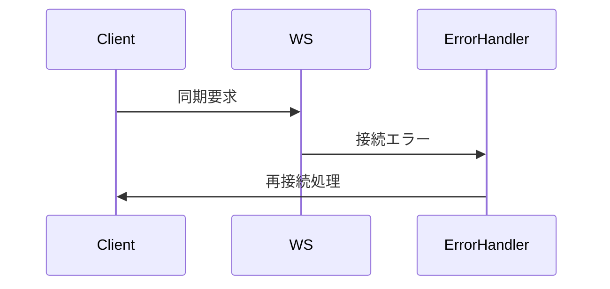

## キャッシュフロー

### 1. データキャッシュ
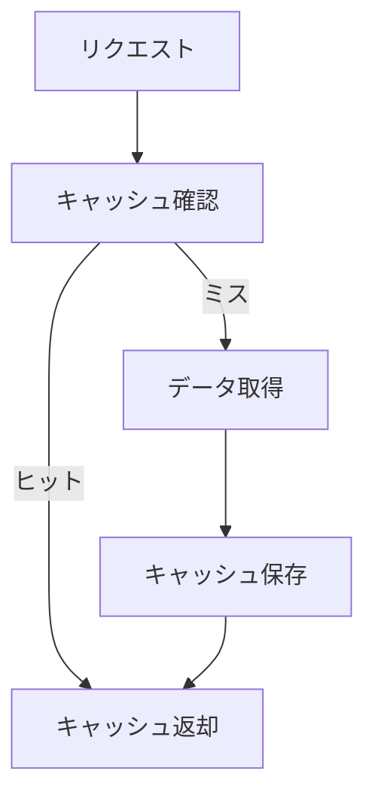

### 2. レンダリングキャッシュ
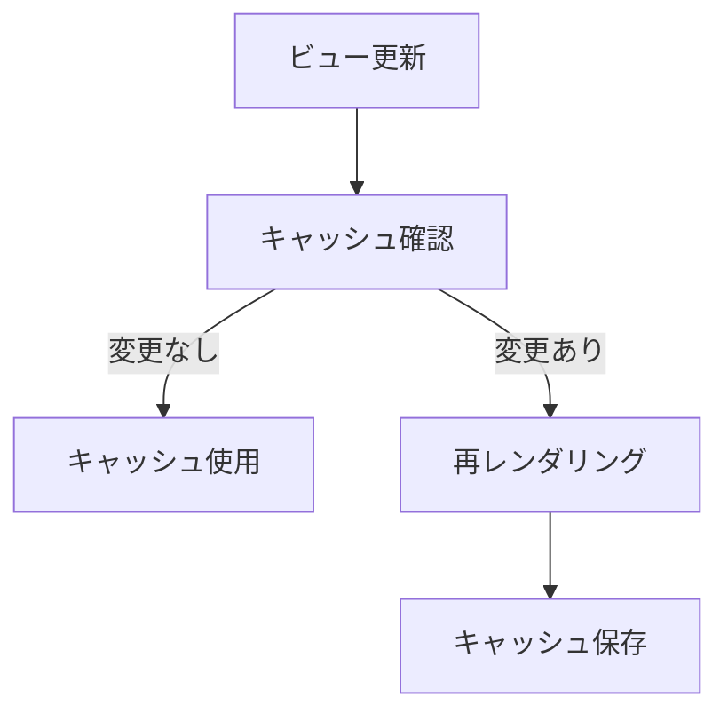

## パフォーマンス最適化フロー

### 1. バッチ処理
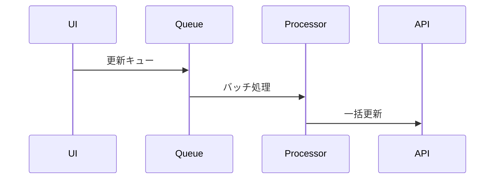

### 2. 遅延読み込み
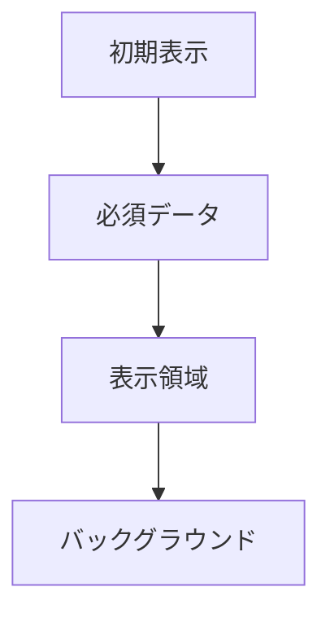

## セキュリティフロー

### 1. 認証フロー
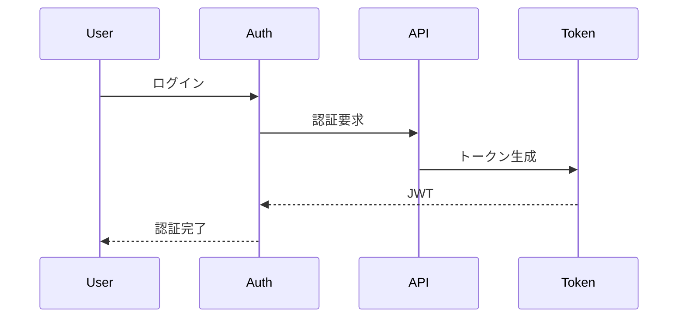

### 2. 権限チェック
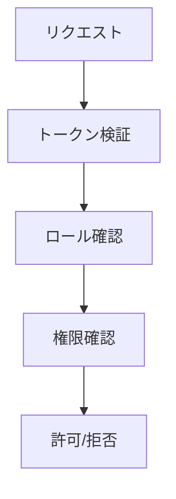