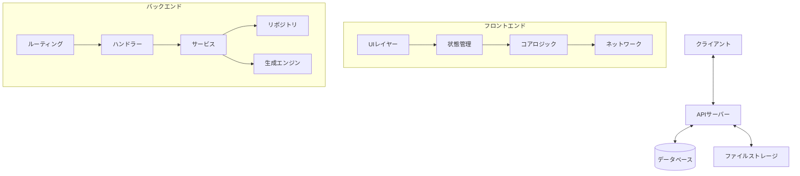
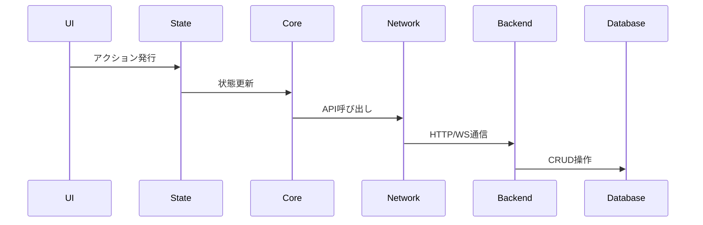
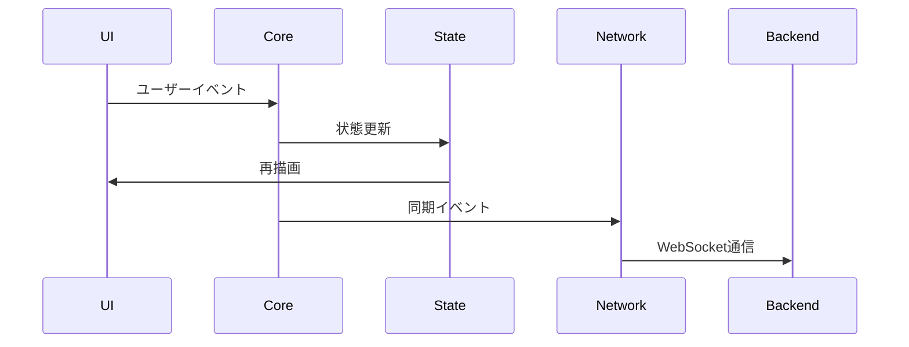

# モジュール構成図

## 概要
RDDMシステムのモジュール構成とその関係性の定義。

## システム全体構成



## フロントエンドモジュール

### 1. UIレイヤー
```typescript
// src/ui/
├── components/       # 再利用可能なコンポーネント
├── pages/           # ページコンポーネント
├── layouts/         # レイアウトコンポーネント
└── hooks/           # カスタムフック
```

### 2. 状態管理
```typescript
// src/store/
├── global/          # グローバル状態
│   ├── auth.ts     # 認証状態
│   └── project.ts  # プロジェクト状態
├── editor/         # エディ���状態
│   ├── canvas.ts   # キャンバス状態
│   ├── tools.ts    # ツール状態
│   └── history.ts  # 履歴状態
└── ui/             # UI状態
    ├── theme.ts    # テーマ設定
    └── layout.ts   # レイアウト設定
```

### 3. コアロジック
```typescript
// src/core/
├── geometry/        # 図形処理
│   ├── shapes.ts   # 基本図形
│   ├── transform.ts # 変換処理
│   └── math.ts     # 数学ユーティリティ
├── elements/       # 要素管理
│   ├── room.ts     # 部屋要素
│   ├── wall.ts     # 壁要素
│   └── opening.ts  # 開口部要素
└── operations/     # 操作処理
    ├── create.ts   # 作成操作
    ├── modify.ts   # 修正操作
    └── delete.ts   # 削除操作
```

### 4. ネットワーク
```typescript
// src/network/
├── api/            # REST API
│   ├── project.ts  # プロジェクトAPI
│   ├── element.ts  # 要素API
│   └── view.ts     # ビューAPI
├── ws/             # WebSocket
│   ├── client.ts   # WSクライアント
│   └── events.ts   # イベント定義
└── sync/           # 同期処理
    ├── queue.ts    # 更新キュー
    └── conflict.ts # 競合解決
```

## バックエンドモジュール

### 1. ルーティング
```rust
// src/routes/
├── project.rs      # プロジェクト関連
├── element.rs      # 要素関連
├── view.rs         # ビュー関連
└── ws.rs          # WebSocket
```

### 2. ハンドラー
```rust
// src/handlers/
├── project.rs      # プロジェクトハンドラー
├── element.rs      # 要素ハンドラー
├── view.rs         # ビューハンドラー
└── ws.rs          # WebSocketハンドラー
```

### 3. サービス
```rust
// src/services/
├── project.rs      # プロジェクト操作
├── element.rs      # 要素操作
├── view.rs         # ビュー操作
├── sync.rs         # 同期処理
└── export/         # エクスポート
    ├── svg.rs      # SVG生成
    └── pdf.rs      # PDF生成
```

### 4. リポジトリ
```rust
// src/repositories/
├── project.rs      # プロジェクトリポジトリ
├── element.rs      # 要素リポジトリ
├── view.rs         # ビューリポジトリ
└── history.rs      # 履歴リポジトリ
```

### 5. 生成エンジン
```rust
// src/generators/
├── svg/            # SVG生成
│   ├── floor.rs    # 間取り図
│   ├── structure.rs # 構造図
│   └── architect.rs # 意匠図
└── pdf/            # PDF生成
    ├── template.rs  # テンプレート
    └── render.rs    # レンダリング
```

## 共通モジュール

### 1. 型定義
```typescript
// src/types/
├── geometry.ts     # 図形関連
├── element.ts      # 要素関連
├── view.ts         # ビュー関連
└── event.ts        # イベント関連
```

### 2. ユーティリティ
```typescript
// src/utils/
├── validation.ts   # バリデーション
├── conversion.ts   # 変換処理
├── format.ts       # フォーマット
└── logger.ts       # ロギング
```

## モジュール間通信

### 1. データフロー


### 2. イベントフロー


## 依存関係管理

### 1. フロントエンド
```typescript
// package.json
{
  "dependencies": {
    "react": "^18.0.0",
    "jotai": "^2.0.0",
    "konva": "^9.0.0",
    "axios": "^1.0.0",
    "socket.io-client": "^4.0.0"
  }
}
```

### 2. バックエンド
```toml
# Cargo.toml
[dependencies]
axum = "0.7"
tokio = { version = "1.0", features = ["full"] }
sqlx = { version = "0.7", features = ["sqlite"] }
resvg = "0.35"
pdf-rs = "0.4"
```

## デプロイメント構成

### 1. コンテナ構成
```yaml
# docker-compose.yml
services:
  frontend:
    build: ./frontend
    ports: ["3000:3000"]
  
  backend:
    build: ./backend
    ports: ["8000:8000"]
  
  db:
    image: sqlite:latest
    volumes: ["./data:/data"]
```

## スケーラビリティ

### 1. 水平スケーリング
- フロントエンドのCDN配信
- バックエンドのロードバランシング
- WebSocketのクラスタリング

### 2. 垂直スケーリング
- データベースのパフォーマンスチューニング
- キャッシュ戦略の実装
- バッチ処理の最適化
``` 