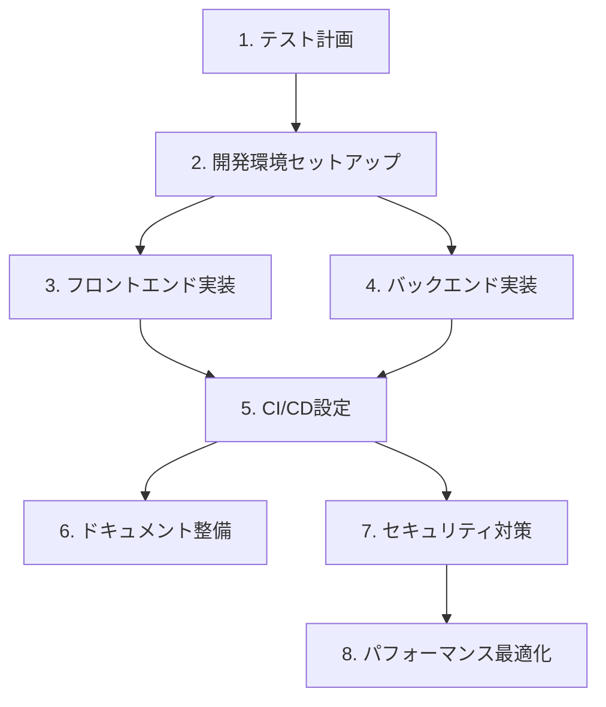

# MVP実装ロードマップ

## 1. テスト計画 (現在のフェーズ)
- [ ] テストケース定義
  - [ ] ユニットテスト計画
  - [ ] 統合テスト計画
  - [ ] E2Eテスト計画
- [ ] テスト環境要件
  - [ ] テストデータ設計
  - [ ] モック/スタブ戦略
  - [ ] CI環境要件
- [ ] 品質基準定義
  - [ ] カバレッジ目標
  - [ ] パフォーマンス基準
  - [ ] 品質メトリクス

## 2. 開発環境セットアップ
- [ ] Docker環境構築
  - [ ] フロントエンド開発環境
  - [ ] バックエンド開発環境
  - [ ] データベース環境
- [ ] VSCode設定
  - [ ] 拡張機能セットアップ
  - [ ] デバッグ設定
  - [ ] コード補完設定
- [ ] Git/GitHub設定
  - [ ] リポジトリ構成
  - [ ] ブランチ戦略
  - [ ] コミットルール

## 3. フロントエンド実装
- [ ] プロジェクト初期化
  - [ ] Vite + React + TypeScript
  - [ ] ESLint + Prettier
  - [ ] TailwindCSS
  - [ ] Jotai
  - [ ] Konva.js
- [ ] 共通コンポーネント実装
  - [ ] レイアウト
  - [ ] ヘッダー
  - [ ] サイドバー
  - [ ] モーダル
- [ ] 認証機能実装
  - [ ] ログインフォーム
  - [ ] 認証状態管理
  - [ ] 保護されたルート
- [ ] プロジェクト管理機能
  - [ ] プロジェクト一覧
  - [ ] プロジェクト作成
  - [ ] プロジェクト編集
- [ ] エディタ機能実装
  - [ ] キャンバス設定
  - [ ] ツールバー
  - [ ] プロパティパネル
  - [ ] 図形描画機能
  - [ ] 寸法入力機能
  - [ ] 選択・移動機能

## 4. バックエンド実装
- [ ] プロジェクト初期化
  - [ ] Rust + Axum
  - [ ] SQLx + SQLite
  - [ ] CORS設定
  - [ ] ログ設定
- [ ] データベース実装
  - [ ] マイグレーション
  - [ ] シードデータ
  - [ ] リポジトリ層
- [ ] API実装
  - [ ] 認証API
  - [ ] プロジェクトAPI
  - [ ] 図面要素API
  - [ ] ビューAPI
- [ ] WebSocket実装
  - [ ] 接続管理
  - [ ] イベント処理
  - [ ] 同期処理
- [ ] ファイル処理実装
  - [ ] SVG生成
  - [ ] PDF出力
  - [ ] ファイル保存

## 5. CI/CD設定
- [ ] GitHub Actions設定
  - [ ] ビルドチェック
  - [ ] テスト実行
  - [ ] リンター実行
  - [ ] Docker イメージ生成
- [ ] デプロイメントパイプライン
  - [ ] ステージング環境
  - [ ] 本番環境
  - [ ] ロールバック手順

## 6. ドキュメント整備
- [ ] README更新
- [ ] API仕様書
- [ ] デプロイメントガイド
- [ ] 開発ガイド
- [ ] ユーザーマニュアル

## 7. セキュリティ対策
- [ ] 脆弱性診断
- [ ] セキュリティヘッダー設定
- [ ] 入力バリデーション
- [ ] レート制限実装
- [ ] エラーハンドリング

## 8. パフォーマンス最適化
- [ ] フロントエンド最適化
  - [ ] バンドルサイズ最適化
  - [ ] レンダリング最適化
  - [ ] キャッシュ戦略
- [ ] バックエンド最適化
  - [ ] クエリ最適化
  - [ ] キャッシュ層
  - [ ] 非同期処理

## 実行順序と依存関係



## タイムライン目安
1. テスト計画: 3日
2. 開発環境セットアップ: 2日
3. フロントエンド実装: 10日
4. バックエンド実装: 10日
5. CI/CD設定: 3日
6. ドキュメント整備: 2日
7. セキュリティ対策: 3日
8. パフォーマンス最適化: 3日

合計: 約36日（約7週間）

## 注意点
1. 各フェーズでテストを並行して実装
2. 早期からセキュリティを考慮
3. 定期的なコー��レビュー実施
4. パフォーマンスは継続的にモニタリング
5. ドキュメントは実装と同時に更新
``` 