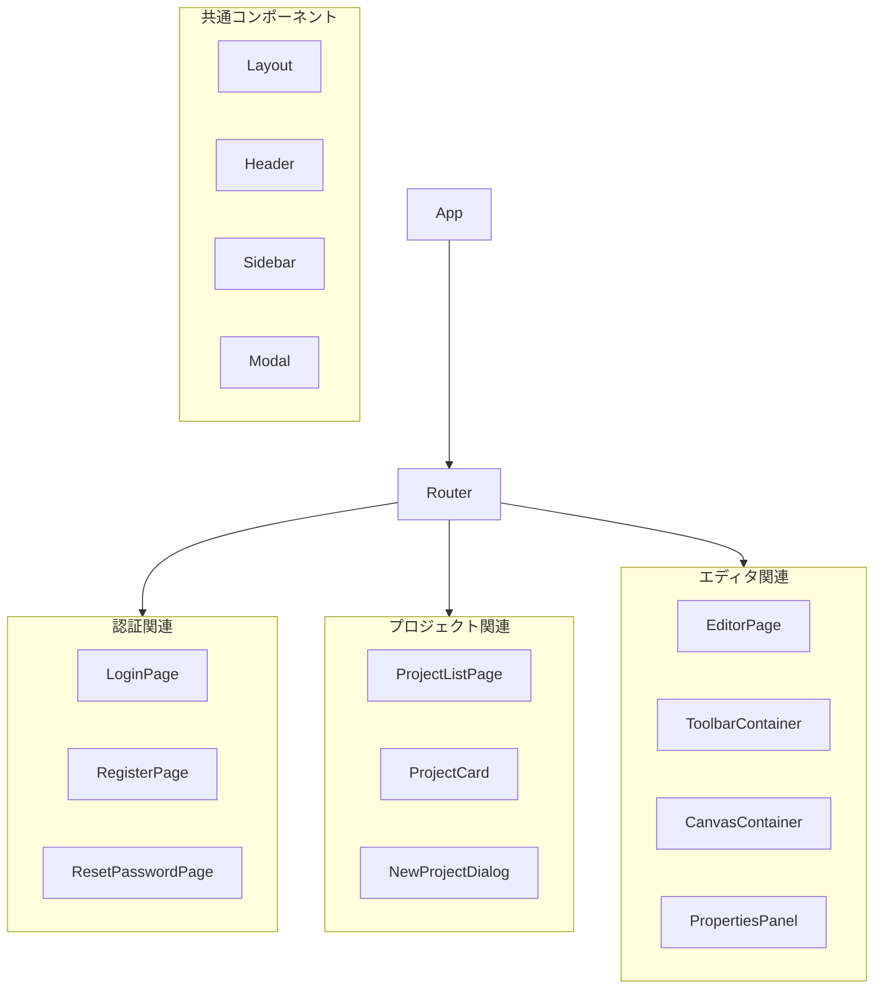

# コンポーネント構造図

## 概要
RDDMシステムのReactコンポーネント構造とその関係性の定義。

## コンポーネント階層



## コンポーネント定義

### 1. 共通コンポーネント

#### 1.1 レイアウト
```typescript
// src/components/Layout
interface LayoutProps {
  header?: React.ReactNode;
  sidebar?: React.ReactNode;
  children?: React.ReactNode;
}
```

#### 1.2 ヘッダー
```typescript
// src/components/Header
interface HeaderProps {
  title: string;
  onMenuClick?: () => void;
  actions?: React.ReactNode[];
  showMenuIcon?: boolean;
}
```

#### 1.3 サイドバー
```typescript
// src/components/Sidebar
interface MenuItem {
  id: string;
  label: string;
  icon?: React.ReactNode;
  onClick?: () => void;
  selected?: boolean;
  divider?: boolean;
}

interface SidebarProps {
  items: MenuItem[];
  width?: number;
  open?: boolean;
  variant?: 'permanent' | 'persistent' | 'temporary';
  onClose?: () => void;
}
```

#### 1.4 モーダル
```typescript
// src/components/Modal
interface ModalProps {
  open: boolean;
  title: string;
  onClose: () => void;
  onConfirm?: () => void;
  confirmText?: string;
  cancelText?: string;
  showCloseButton?: boolean;
  maxWidth?: 'xs' | 'sm' | 'md' | 'lg' | 'xl';
  fullWidth?: boolean;
  children: React.ReactNode;
  actions?: React.ReactNode;
}
```

### 2. エディタコンポーネント

#### 2.1 キャンバス
```typescript
// src/components/editor/Canvas
interface CanvasProps {
  width: number;
  height: number;
  elements: Element[];
  viewType: ViewType;
  onElementSelect: (element: Element) => void;
  onElementUpdate: (element: Element) => void;
  onElementCreate: (element: Element) => void;
}

// キャンバスレイヤー構造
interface CanvasLayers {
  background: Layer;  // グリッド、ガイド
  content: Layer;     // 図面要素
  overlay: Layer;     // 選択、ハイライト
  interaction: Layer; // ドラッグ、リサイズハンドル
}
```

#### 2.2 ツールバー
```typescript
// src/components/editor/Toolbar
interface ToolbarProps {
  activeView: ViewType;
  onViewChange: (view: ViewType) => void;
  onToolSelect: (tool: ToolType) => void;
  onAction: (action: ActionType) => void;
}

// ツールバーグループ
interface ToolbarGroup {
  id: string;
  title: string;
  tools: Tool[];
}
```

#### 2.3 プロパティパネル
```typescript
// src/components/editor/Properties
interface PropertiesProps {
  element?: Element;
  onChange: (changes: Partial<Element>) => void;
}

// プロパティフィールド
interface PropertyField {
  key: string;
  type: 'text' | 'number' | 'select' | 'color';
  label: string;
  value: any;
  options?: Option[];
}
```

### 3. 図形コンポーネント

#### 3.1 基本図形
```typescript
// src/components/shapes/Base
interface BaseShapeProps {
  id: string;
  geometry: Geometry;
  style: ShapeStyle;
  selected?: boolean;
  interactive?: boolean;
  onSelect?: () => void;
  onGeometryChange?: (geometry: Geometry) => void;
}
```

#### 3.2 部屋
```typescript
// src/components/shapes/Room
interface RoomProps extends BaseShapeProps {
  type: RoomType;
  area: number;
  usage: string;
}
```

#### 3.3 開口部
```typescript
// src/components/shapes/Opening
export type OpeningType = 'door' | 'window' | 'sliding' | 'folding' | 'fixed'

interface OpeningProps extends BaseShapeProps {
  type: OpeningType;
  width: number;
  height: number;
  elevation: number;
  direction?: 'left' | 'right' | 'both';  // 開き方向
  swing?: number;  // 開き角度（度）
  isExterior?: boolean;  // 外部開口部かどうか
  sillHeight?: number;  // 下枠高さ
  lintelHeight?: number;  // 上枠高さ
}

// 開口部スタイル定義
interface OpeningStyle extends ShapeStyle {
  frameColor: string;  // 枠の色
  frameWidth: number;  // 枠の幅
  glassOpacity?: number;  // ガラスの透明度（窓の場合）
}

// 開口部の状態
interface OpeningState {
  isOpen: boolean;  // 開いているかどうか
  openAngle: number;  // 現在の開き角度
}
```

### 4. 制御コンポーネント

#### 4.1 ドラッグハンドル
```typescript
// src/components/controls/DragHandle
interface DragHandleProps {
  position: Point;
  onDragStart: () => void;
  onDrag: (delta: Point) => void;
  onDragEnd: () => void;
}
```

#### 4.2 リサイズハンドル
```typescript
// src/components/controls/ResizeHandle
interface ResizeHandleProps {
  bounds: Bounds;
  onResizeStart: () => void;
  onResize: (newBounds: Bounds) => void;
  onResizeEnd: () => void;
}
```

## 状態管理

### 1. グローバル状態
```typescript
// src/store/global
interface GlobalState {
  user: UserInfo | null;
  project: Project | null;
  view: ViewType;
  selectedElements: string[];
}
```

### 2. エディタ状態
```typescript
// src/store/editor
interface EditorState {
  elements: Record<string, Element>;
  activeTool: ToolType;
  viewState: ViewState;
  history: HistoryState;
}
```

### 3. UI状態
```typescript
// src/store/ui
interface UIState {
  sidebarCollapsed: boolean;
  propertiesPanelWidth: number;
  zoom: number;
  pan: Point;
}
```

## イベントハンドリング

### 1. キャンバスイベント
```typescript
// src/events/canvas
interface CanvasEvents {
  onMouseDown: (e: MouseEvent) => void;
  onMouseMove: (e: MouseEvent) => void;
  onMouseUp: (e: MouseEvent) => void;
  onWheel: (e: WheelEvent) => void;
  onKeyDown: (e: KeyboardEvent) => void;
}
```

### 2. 要素イベント
```typescript
// src/events/element
interface ElementEvents {
  onSelect: (element: Element) => void;
  onDeselect: (element: Element) => void;
  onMove: (element: Element, delta: Point) => void;
  onResize: (element: Element, bounds: Bounds) => void;
}
```

## スタイリング

### 1. テーマ設定
```typescript
// src/styles/theme
interface Theme {
  colors: ColorPalette;
  spacing: SpacingScale;
  typography: Typography;
  shadows: Shadows;
}
```

### 2. コンポーネントスタイル
```typescript
// src/styles/components
interface ComponentStyles {
  common: CommonStyles;
  editor: EditorStyles;
  shapes: ShapeStyles;
}
```

## パフォーマンス最適化

### 1. メモ化戦略
- React.memo for pure components
- useMemo for expensive calculations
- useCallback for event handlers

### 2. 仮想化
- 要素の仮想化リスト
- キャンバスの部分描画
- 遅延読み込み

### 3. バッチ処理
- 状態更新のバッチ化
- WebSocket更新のバッファリング
- 描画更新の最適化
``` 