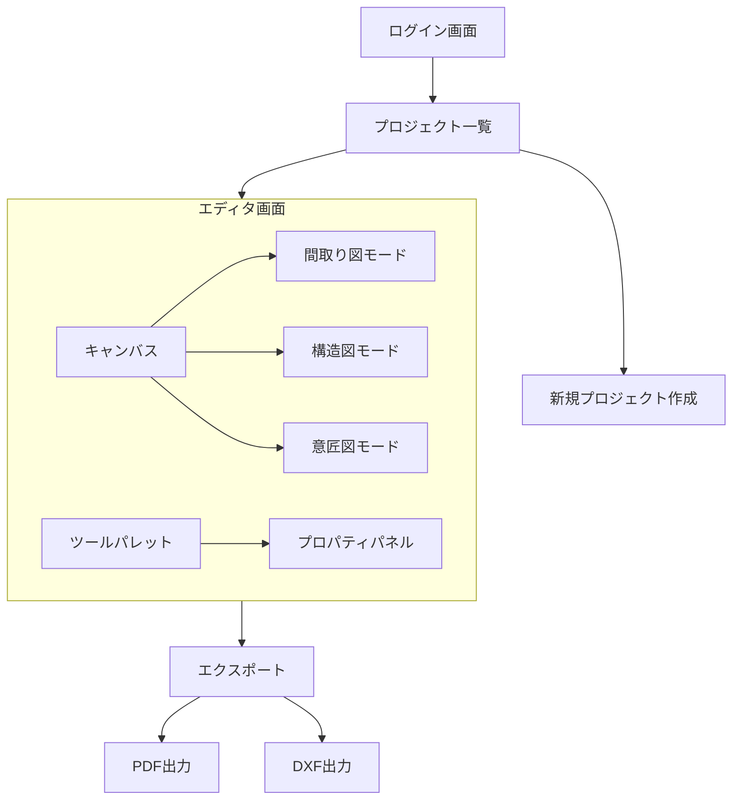
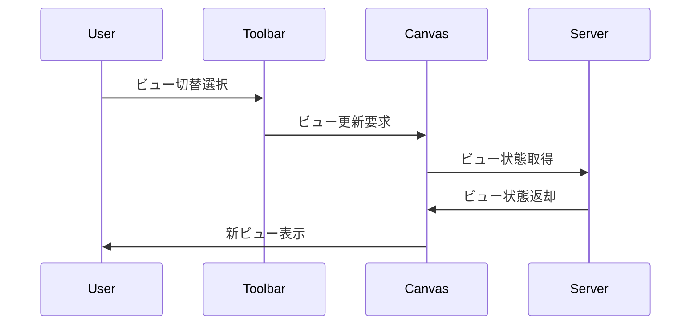

# 画面遷移図

## 概要
RDDMシステムの画面遷移とユーザーフローの定義。

## メイン画面構成



## 画面詳細

### 1. ログイン画面
- 入力項目
  - メールアドレス
  - パスワード
- 機能
  - ログイン
  - パスワードリセット
  - 新規登録

### 2. プロジェクト一覧
- 表示項目
  - プロジェクト名
  - 最終更新日
  - サムネイル
- 機能
  - プロジェクト作成
  - プロジェクト検索
  - プロジェクト削除
  - プロジェクト複製

### 3. エディタ画面

#### 3.1 ツールバー
- ファイル操作
  - 保存
  - エクスポート
  - 印刷
- 編集操作
  - 元に戻す
  - やり直し
  - コピ��
  - 貼り付け
- ビュー切替
  - 間取り図
  - 構造図
  - 意匠図
- 表示操作
  - ズームイン/アウト
  - 全体表示
  - グリッド表示

#### 3.2 ツールパレット
- 描画ツール
  - 部屋（矩形）
  - 壁
  - 開口部
  - 柱
- 編集ツール
  - 選択
  - 移動
  - 回転
  - サイズ変更
- 寸法ツール
  - 長さ
  - 角度
  - 面積

#### 3.3 プロパティパネル
- 共通プロパティ
  - 位置
  - サイズ
  - 角度
  - レイヤー
- 要素固有プロパティ
  - 部屋：用途、面積
  - 壁：厚さ、高さ
  - 開口部：種類、幅、高さ
  - 柱：断面形状、サイズ

#### 3.4 キャンバス
- 操作
  - パン
  - ズーム
  - 要素選択
  - 要素編集
- 表示
  - グリッド
  - スナップ
  - 寸法線
  - 注記

## インタラクションフロー

### 1. 部屋作成フロー
```mermaid
sequenceDiagram
    User->>Canvas: 部屋ツール選択
    User->>Canvas: ドラッグで矩形描画
    Canvas->>Properties: 部屋プロパティ表示
    User->>Properties: プロパティ編集
    Properties->>Canvas: 部屋更新
```

### 2. 開口部編集フロー
```mermaid
sequenceDiagram
    User->>Canvas: 開口部選択
    Canvas->>Properties: 開口部プロパティ表示
    User->>Canvas: ドラッグでサイズ変更
    Canvas->>Server: リアルタイム更新
    Server->>OtherViews: 他ビューに反映
```

### 3. ビュー切替フロー


## エラーハンドリング

### 1. 入力エラー
- 不正な寸法値
- 重複した要素
- 無効な操作

### 2. システムエラー
- 保存失敗
- 同期エラー
- 接続エラー

## アクセシビリティ
1. キーボードショートカット
2. ハイコントラストモード
3. ズーム機能
4. 操作ヘルプ

## レスポンシブ対応
1. 画面サイズに応じたレイアウト調整
2. パネルの折りたたみ
3. モバイル表示最適化

## パフォーマンス考慮
1. キャンバスの描画最適化
2. 要素の遅延読み込み
3. 操作の軽量化
``` 