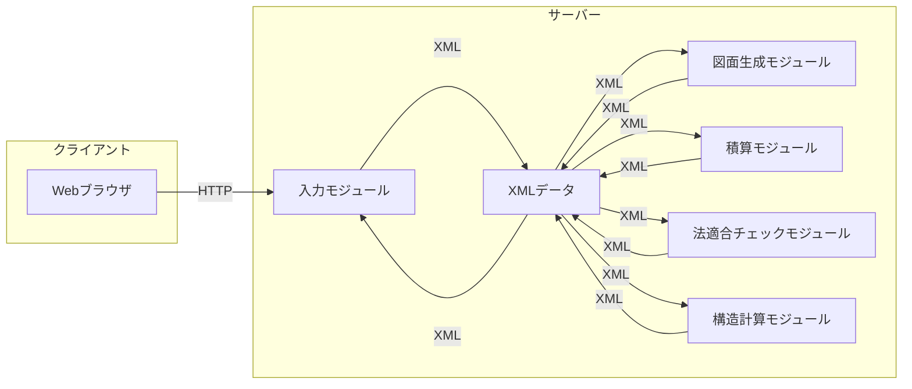

# プロジェクト定義ファイル (Project.rddm)

## メタ情報

```yaml
version: 1.0.0
project_name: "パラメトリック建築図書ジェネレーター"
created_date: 2024-12-11
last_modified: 2024-12-15
encoding: UTF-8
verification_level: strict
execution_mode: sequential
mvp_version: 0.1.0
```

## 1. プロジェクト構造定義

### 1.1 MVP 優先順位

```yaml
priority_levels:
  P1: "MVP必須機能"
  P2: "MVP重要機能"
  P3: "MVP追加機能"
  P4: "将来拡張"

core_features:
  - name: "基本設計機能"
    priority: P1
    components:
      - "間取り入力"
      - "構造材入力"
      - "基本図面生成"

  - name: "法適合チェック"
    priority: P2
    components:
      - "採光計算"
      - "換気計算"
      - "面積計算"

  - name: "積算機能"
    priority: P2
    components:
      - "材料数量計算"
      - "基本見積作成"

  - name: "構造計算"
    priority: P2
    components:
      - "壁量計算"
      - "基本許容応力度計算"

technical_stack:
  frontend:
    framework: "React"
    language: "TypeScript"
    priority: P1
    description: "UIレイヤーはTypeScript+Reactを維持（WebAssemblyでRustと連携）"

  backend:
    framework: "Axum"
    language: "Rust"
    priority: P1
    description: "高性能・安全性が求められるバックエンドをRustで実装"

  core_engine:
    language: "Rust"
    features:
      - "図面生成エンジン"
      - "構造計算エンジン"
      - "法規チェックエンジン"
    priority: P1
    description: "計算・処理が重要な部分をRustで実装"

  database:
    primary: "SQLite"
    orm: "SQLx"
    priority: P1
    description: "開発・デプロイの容易さを考慮しSQLiteを維持"

  rendering:
    2d:
      type: "SVG"
      engine: "resvg"
      output: "PDF"
    3d:
      library: "Three.js"
      wasm_backend: "Rust"
    priority: P1
    description: "描画エンジンをRustで最適化"

  build_tools:
    frontend: "Vite"
    backend: "Cargo"
    wasm: "wasm-pack"
    priority: P1
```

### 1.1 ファイル構成

```z
[ファイル, パス, バージョン, 依存関係, 検証レベル]

スキーマ プロジェクト構造
  ファイル集合: ℙ ファイル
  ファイルパス: ファイル → パス
  ファイルバージョン: ファイル → バージョン
  依存グラフ: ファイル ↔ ファイル
  検証要件: ファイル → 検証レベル

  -- 不変条件
  dom ファイルパス = ファイル集合
  dom ファイルバージョン = ファイル集合
  dom 依存グラフ ⊆ ファイル集合
  ran 依存グラフ ⊆ ファイル集合
  dom 検証要件 = ファイル集合
```

### 1.2 実行順序定義

```z
スキーマ 実行順序
  プロジェクト構造
  実行ステップ: ℕ ⇸ ℙ ファイル

  -- 不変条件
  ∀ s1, s2: dom 実行ステップ | s1 < s2 ⇒
    (∀ f1: 実行ステップ(s1); f2: 実行ステップ(s2) •
      (f2, f1) ∉ 依存グラフ)
```

## 2. ファイル定義

### 2.1 要件定義ファイル群

```yaml
directory: /requirements/
files:
  - name: business.rddm
    type: requirements
    validation: strict
    dependencies: []
    execution_step: 1
    schema:
      - section: "ビジネス要件"
        marker: "[MVP-P1]"
        format: "CNL"
        required: true
      - section: "制約条件"
        format: "Z-Notation"
        required: true

  - name: functional.rddm
    type: requirements
    validation: strict
    dependencies: ["business.rddm"]
    execution_step: 2
    schema:
      - section: "機能要件"
        marker: "[MVP-P1]"
        format: "BDD"
        required: true
      - section: "検証条件"
        format: "Z-Notation"
        required: true
```

#### business.rddm (CNL 形式)

##### ビジネス要件

- **[MVP-P1] BR1**: システムは、施主、設計事務所、工務店、職人をターゲットユーザーとする。
- **[MVP-P1] BR2**: システムは、木造住宅の設計、積算、法適合チェック、構造計算を支援する。
- **[MVP-P2] BR3**: システムは、ユーザーに以下のメリットを提供する:
  - 施主: コスト削減、品質向上
  - 設計事務所、工務店: 業務効率化、コスト削減
  - 職人: 適正な報酬、労働環境の改善
- **[MVP-P1] BR4**: システムは日本国内の小規模木造住宅（延床面積 150㎡ 以下）を対象とする。
- **[MVP-P2] BR5**: システムは、建築基準法、都市計画法、消防法、省エネ法、建築士法、住宅の品質確保の促進等に関する法律、長期優良住宅の普及の促進に関する法律、建築物のエネルギー消費性能の向上に関する法律に準拠する。
- **BR6**: システムは、フリーミアムモデルを採用し、無料版では機能制限を設け、有料版では全機能を提供する。
- **BR7**: システムは、建築関連企業を広告主とした広告モデルを採用する。
- **BR8**: システムは、ライセンス販売、カスタマイズ開発、コンサルティングを通じて、大手企業から収益を得る。
- **BR9**: システムは、低価格、オープンソース化の可能性、コミュニティ機能を競合製品との差別化要素とする。
- **BR10**: システムは、Web マーケティング、展示会への出展、業界団体との連携を通じて普及を図る。

##### 制約条件

```z
スキーマ 制約条件
  開発期間: ℕ
  開発予算: ℕ

  -- 制約条件
  開発期間 = 24 -- 単位は月
  開発予算 = 50000000 -- 単位は円
```

#### functional.rddm (BDD 形式)

##### 機能要件

**[MVP-P1] フィーチャー 1**: 間取り入力

**シナリオ 1**: ユーザーが手書きの間取り図をアップロードする - **前提**: ユーザーがログインしている - **Given**: ユーザーが「間取り入力」画面を開いている - **And**: 「手書き」タブが選択されている - **When**: ユーザーが間取り図の画像ファイルを選択する - **And**: 「アップロード」ボタンをクリックする - **Then**: システムは間取り図を解析し、壁、開口部、部屋を認識する - **And**: 認識結果が画面に表示される - **And**: 認識結果が 90%以上である

**シナリオ 2**: ユーザーがグリッドを使って間取りを入力する - **前提**: ユーザーがログインしている - **Given**: ユーザーが「間取り入力」画面を開いている - **And**: 「グリッド」タブが選択されている - **When**: ユーザーがグリッド上に壁、開口部、部屋を配置する - **Then**: システムは入力された情報を基に、間取り図を生成する - **And**: 生成された間取り図が画面に表示される

**フィーチャー 2**: 構造材入力

**シナリオ 1**: ユーザーが柱を入力する - **前提**: ユーザーがログインしている - **And**: 間取りが入力されている - **Given**: ユーザーが「構造材入力」画面を開いている - **And**: 「柱」タブが選択されている - **When**: ユーザーが柱を配置する位置をクリックする - **Then**: システムは柱を配置する - **And**: 柱のプロパティ設定ウィンドウが表示される - **And**: ユーザーが柱の基準点、高さ、断面寸法、材質、勝ち負けを設定できる

**シナリオ 2**: ユーザーが梁を入力する - **前提**: ユーザーがログインしている - **And**: 間取りが入力されている - **Given**: ユーザーが「構造材入力」画面を開いている - **And**: 「梁」タブが選択されている - **When**: ユーザーが梁の始点をクリックする - **And**: ユーザーが梁の終点をクリックする - **Then**: システムは梁を配置する - **And**: 梁のプロパティ設定ウィンドウが表示される - **And**: ユーザーが梁の断面形状、材質を設定できる

**フィーチャー 3**: 図面生成

**シナリオ 1**: ユーザーが平面図を生成する - **前提**: ユーザーがログインしている - **And**: 間取りと構造材が入力されている - **Given**: ユーザーが「図面生成」画面を開いている - **And**: 「平面図」タブが選択されている - **When**: ユーザーが「生成」ボタンをクリックする - **Then**: システムは平面図を生成する - **And**: 生成された平面図が画面に表示される - **And**: 平面図には、方位、寸法線、開口部寸法、部屋名、面積、床高さ、建具・サッシ番号、通り芯、床板の貼り方向が表示される

**シナリオ 2**: ユーザーが立面図を生成する - **前提**: ユーザーがログインしている - **And**: 間取りと構造材が入力されている - **Given**: ユーザーが「図面生成」画面を開いている - **And**: 「立面図」タブが選択されている - **When**: ユーザーが「生成」ボタンをクリックする - **Then**: システムは立面図を生成する - **And**: 生成された立面図が画面に表示される - **And**: 立面図には、東西南北の図面、軒樋と境界線または軒先と境界線の距離、屋根勾配、各高さ（GL、基礎高さ、床面高さ、桁高さ、最高高さ）、境界線、斜線、窓が表示される

**フィーチャー 4**: 積算

**シナリオ 1**: ユーザーが数量を確認する - **前提**: ユーザーがログインしている - **And**: 間取り、構造材、仕上げ材、設備が入力されている - **Given**: ユーザーが「積算」画面を開いている - **When**: ユーザーが「数量表示」タブを選択する - **Then**: システムは建物の基本数量、部材積算、工程積算を表示する

**シナリオ 2**: ユーザーが見積書を生成する - **前提**: ユーザーがログインしている - **And**: 間取り、構造材、仕上げ材、設備が入力されている - **Given**: ユーザーが「積算」画面を開いている - **When**: ユーザーが「見積書」タブを選択する - **And**: 「生成」ボタンをクリックする - **Then**: システムは見積書を生成する - **And**: 生成された見積書が画面に表示される

**フィーチャー 5**: 法適合チェック

**シナリオ 1**: ユーザーが採光を確認する - **前提**: ユーザーがログインしている - **And**: 間取り、開口部が入力されている - **Given**: ユーザーが「法適合」画面を開いている - **And**: 「採光」タブが選択されている - **When**: ユーザーが「チェック」ボタンをクリックする - **Then**: システムは採光に関する法適合をチェックする - **And**: チェック結果が画面に表示される

**シナリオ 2**: ユーザーが斜線制限を確認する - **前提**: ユーザーがログインしている - **And**: 間取り、構造材、情報が入力されている - **Given**: ユーザーが「法適合」画面を開いている - **And**: 「斜線制限」タブが選択されている - **When**: ユーザーが「チェック」ボタンをクリックする - **Then**: システムは斜線制限に関する法適合をチェックする - **And**: チェック結果が画面に表示される

**フィーチャー 6**: 構造計算

**シナリオ 1**: ユーザーが壁量計算を実行する - **前提**: ユーザーがログインしている - **And**: 間取り、構造材が入力されている - **Given**: ユーザーが「構造計算」画面を開いている - **And**: 「量計算」タブが選択されている - **When**: ユーザーが「計算」ボタンをクリックする - **Then**: システムは壁量計算を実行する - **And**: 計算結果が画面に表示される - **And**: 必要壁量、壁量充足率、壁の配置バランスが表示される

**シナリオ 2**: ユーザーが許容応力度計算を実行する - **前提**: ユーザーがログインしている - **And**: 間取り、構造材が入力されている - **Given**: ユーザーが「構造計算」画面を開いている - **And**: 「許容応力度計算」タブが選択されている - **When**: ユーザーが「計算」ボタンをクリックする - **Then**: システムは許容応力度計算を実行する - **And**: 計算結果が画面に表示される - **And**: 部材の許容応力度、基礎の支持力、地盤の許容応力度、地震力・風力・荷重に対する検討結果が表示される

##### 検証条件

```z
スキーマ 検証条件
  -- 各フィーチャーのシナリオでThen以降に記述されている内容が満たされていることを検証する
```

### 2.2 設計ファイル群

```yaml
directory: /design/
files:
  - name: architecture.rddm
    type: design
    validation: strict
    dependencies: ["requirements/business.rddm", "requirements/functional.rddm"]
    execution_step: 3
    schema:
      - section: "アーキテクチャ定義"
        format: "Z-Notation"
        required: true
      - section: "コンポーネント図"
        format: "mermaid"
        required: true

  - name: database.rddm
    type: design
    validation: strict
    dependencies: ["architecture.rddm"]
    execution_step: 4
    schema:
      - section: "データモデル"
        format: "Z-Notation"
        required: true
      - section: "正規化定義"
        format: "mathematical"
        required: true

  - name: components.rddm
    type: design
    validation: strict
    dependencies: ["design/architecture.rddm"]
    execution_step: 5
    schema:
      - section: "コンポーネント定義"
        format: "Z-Notation"
        required: true
      - section: "インターフェース定義"
        format: "OCL"
        required: true
```

#### architecture.rddm

##### アーキテクチャ定義

- システムは、クライアントサーバーモデルを採用する。
- クライアントは、Web ブラウザ上で動作する Web アプリケーションとして実装される。
- サーバーは、Python で開発され、REST API を提供する。
- サーバーは、以下のモジュールで構成される:
  - 入力モジュール: 間取り、構造材、仕上げ材、設備などの入力を処理する。
  - 図面生成モジュール: 平面図、立面図、矩計図、展開図などの図面を生成する。
  - 積算モジュール: 建物の数量を積算し、見 ��� 書を生成する。
  - 法適合チェックモジュール: 建築基準法などの法律への適合をチェックする。
  - 構造計算モジュール: 壁量計算、許容応力度計算などを実行する。
- サーバーは、XML データを中間データとして使用し、各モジュール間でデータの連携を行う。
- XML データは、独自のフォーマト（.stxml）で定義され、IFC および CEDXM との相互変換が可能である。

##### コンポーネント図



#### database.rddm

##### データモデル

- データベースは、SQLite と PostgreSQL の両方に対応する。
- データベースには、以下の情報を格納する:
  - ユーザー情報: ユーザー ID、パスワード、メールアド ��� スなど
  - プロジェクト情報: プロジェクト名、作成者、作成日など
  - 建物情報: 敷地情報、建物用途、構造種別、階数、延床面積など
  - 間取り情報: 部屋、壁、開口部などの情報
  - 構造材情報: 柱、梁、土台、屋根などの情報
  - 仕上げ材情報: 外壁材、屋根材、床材、内装材などの情報
  - 設備情報: キッチン、バス、トイレ、給湯設備、換気設備、空調設備などの情報
  - 図面情報: 平面図、立面図、矩計図、展開図などの図面データ
  - 積算情報: 建物の数量、見積金額など
  - 法適合チェック結果: 採光、換気、斜線制限などのチェック結果
  - 構造計算結果: 壁量計算、許容応力度計算などの計算結果

##### 正規化定義

- データベースは、第三正規形まで正規化する。

#### components.rddm

##### コンポーネント定義

- **入力コンポーネント**:
  - ユーザーからの入力を受け付け、検証し、内部データモデルに変換する。
  - サブコンポーネント:
    - 間取り入力: 手書き画像認識、グリッド入力
    - 構造材入力: 柱、梁、壁、開口部、土台、屋根
    - 仕様入力: 仕上げ材、設備、電気設備、構造金物
- **図面生成コンポーネント**:
  - 内部データモデルから、各種図面を生成する。
  - サブコンポーネント:
    - 平面図生成
    - 立面図生成
    - 矩計図生成
    - 展開図生成
- **積算コンポーネント**:
  - 内部データモデルから、数量を積算し、見積書を生成する。
  - サブコンポーネント:
    - 数量積算
    - 見積書生成
- **法適合チェックコンポーネント**:
  - 内部データモデルを基に、建築基準法などの法律への適合をチェックする。
  - サブコンポーネント:
    - 採光チェック
    - 換気チェック
    - 結露チェック
    - 24 時間換気チェック
    - 小屋裏換気チェック
    - 床下換気チェック
    - 省エネ計算
    - 斜線制限チェック
    - 面積制限チェック
    - 防火チェック
    - 敷地チェック
- **構造計算コンポーネント**:
  - 内部データモデルを基に、構造計算を実行する。
  - サブコンポーネント:
    - 地盤判定
    - 仕様規定（壁量計算）
    - ルート１（許容応力度計算）
- **データアクセスコンポーネント**:
  - データベースへのアクセスを抽象化し、データの読み書きを行う。
- **ユーティリティコンポーネント**:
  - 各コンポーネントで共通して使用される機能を提供する。
  - 例: ログ出力、エラーハンドリング

##### インターフェース定義

- **入力コンポーネント**:
  - `InputInterface`:
    - `void inputDrawing(Image image)`: 手書きの間取り図を画像として入力する。
    - `void inputGrid(Grid grid)`: グリッド情報を入力する。
    - `void inputComponent(Component component)`: 各コンポーネント（柱、梁など）の情報を入力する。
- **図面生成コンポーネント**:
  - `DrawingInterface`:
    - `Drawing generatePlan(Scale scale)`: 指定された縮尺で平面図を生成する。
    - `Drawing generateElevation(Direction direction, Scale scale)`: 指定された方向と縮尺で立面図を生成する。
    - `Drawing generateSection(Point point, Direction direction, Scale scale)`: 指定された位置、方向、縮尺で矩計図を生成する。
    - `Drawing generateDeployment(Room room, Scale scale)`: 指定された部屋と縮尺で展開図を生成する。
- **積算コンポーネント**:
  - `CalculationInterface`:
    - `Quantity calculateQuantity()`: 建物の数量を計算する。
    - `Estimate generateEstimate()`: 見積書を生成する。
- **法適合チェックコンポーネント**:
  - `LawInterface`:
    - `Result checkLighting()`: 採光に関する法適合をチェックする。
    - `Result checkVentilation()`: 換気に関する法適合をチェックする。
    - `Result checkCondensation()`: 結露に関する法適合をチェックする。
    - `Result check24HourVentilation()`: 24 時間換気に関する法適合をチェックする。
    - `Result checkAtticVentilation()`: 小屋裏換気に関する法適合をチェックする。
    - `Result checkUnderfloorVentilation()`: 床下換気に関する法適合をチェックする。
    - `Result calculateEnergySaving()`: 省エネ計算を実行する。
    - `Result checkSlantLineLimitation()`: 斜線制限に関する法適合をチェックする。
    - `Result checkAreaLimitation()`: 面積制限に関する法適合をチェックする。
    - `Result checkFireproof()`: 耐火防火に関する法適合をチェックする。
    - `Result checkSite()`: 敷地に関する法適合をチェックする。
- **構造計算コンポーネント**:
  - `StructureInterface`:
    - `Result evaluateGround()`: 地盤を評価する。
    - `Result calculateWallQuantity()`: 壁量計算を実行する。
    - `Result calculateAllowableStress()`: 許容応力度計算を実行する。
- **データアクセスコンポーネント**:
  - `DataInterface`:
    - `void saveData(Data data)`: データを保存する。
    - `Data loadData(ID id)`: データを読み込む。
- **ユーティリティコンポーネント**:
  - `UtilityInterface`:
    - `void log(String message)`: ログを出力する。
    - `void handleError(Error error)`: エラーを処理する。

### 2.3 実装ファイル群

```yaml
directory: /implementation/
files:
  - name: components.rddm
    type: implementation
    validation: strict
    dependencies: ["design/architecture.rddm"]
    execution_step: 5
    schema:
      - section: "コンポーネント定義"
        format: "Z-Notation"
        required: true
      - section: "インターフェース定義"
        format: "OCL"
        required: true
```

## 3. 検証ルール

### 3.1 構文検証

```z
スキーマ 構文検証
  ファイル: ファイル集合
  内容: ファイル → テキスト

  -- 検証条件
  ∀ f: ファイル •
    内容(f) matches ファイル形式仕様(f) ∧
    必須セクション存在確認(f) ∧
    参照整合性確認(f)
```

### 3.2 意味検証

```z
スキーマ 意味検証
  Δ構文検証

  -- 検証条件
  ∀ f: ファイル •
    用語一貫性確認(f) ∧
    ビジネスルール整合性確認(f) ∧
    技術的整合性確認(f)
```

## 4. 実行シーケンス制御

### 4.1 シーケンス定義

```z
シーケンス実行制御
  実行順序: ℕ ⇸ ℙ ファイル
  実行状態: ファイル → 状態
  前提条件: ファイル → ℙ 条件

  -- 実行条件
  ∀ f: ファイル •
    実行可能(f) ⇔
      (∀ d: 依存ファイル(f) • 実行状態(d) = 完了) ∧
      前提条件充足確認(f)
```

### 4.2 エラー処理

```z
スキーマ エラー処理
  Δシーケンス実行制御
  エラー: ファイル ⇸ エラー種別
  リカバリー手順: エラー種別 → 処理手順

  -- エラー処理条件
  ∀ f: ファイル | f ∈ dom エラー •
    実行状態′(f) = 失敗 ∧
    リカバリー実行(f, リカバリー手順(エラー(f)))
```

## 5. 変更管理

### 5.1 バージョン管理

```z
スキーマ バージョン管理
  ファイルバージョン履歴: ファイル → seq バージョン
  変更履歴: (ファイル × バージョン) → 変更内容

  -- バージョン管理条件
  ∀ f: ファイル •
    単調増加確認(ファイルバージョン履歴(f)) ∧
    変更履歴完全性確認(f)
```

### 5.2 整合性管理

```z
スキーマ 整合性管理
  Δバージョン管理
  依存バージョン互換性: ファイル × ファイル → bool

  -- 整合性条件
  ∀ f1, f2: ファイル | (f1, f2) ∈ 依存グラフ •
    依存バージョン互換性(f1, f2) = true
```

## 6. ユーティリティ関数

```ocl
-- ファイル形式検証
context ProjectValidator::validateFileFormat(file: File): Boolean
pre: file.exists()
post: result = file.content.conformsTo(file.schema)

-- 依存関係検証
context ProjectValidator::validateDependencies(file: File): Boolean
pre: file.dependencies->notEmpty()
post: file.dependencies->forAll(d | d.status = 'completed')
```

## 7. エラーコード定義

```yaml
error_codes:
  E001:
    description: "構文エラー"
    severity: "critical"
    recovery: "manual"
  E002:
    description: "依存関係エラー"
    severity: "high"
    recovery: "automatic"
  E003:
    description: "整合性エラー"
    severity: "medium"
    recovery: "manual"
```

## 8. テスト基準と品質管理

### 8.1 テスト基準

```yaml
test_levels:
  unit_test:
    priority: P1
    coverage_target: 80%
    components:
      frontend:
        - React components
        - State management
        - Utility functions
      backend:
        - API endpoints
        - Data models
        - Business logic

  integration_test:
    priority: P1
    coverage_target: 70%
    focus_areas:
      - API integration
      - Database operations
      - File operations
      - External service integration

  e2e_test:
    priority: P2
    coverage_target: 60%
    user_flows:
      - 間取り入力フロー
      - 構造材入力フロー
      - 図面生成フロー
      - 積算フロー
      - 法適合チェックフロー

  performance_test:
    priority: P2
    metrics:
      response_time:
        target: "<500ms"
        load: "100 concurrent users"
      memory_usage:
        target: "<512MB"
        condition: "標準的な建築プロジェクト処理時"
```

### 8.2 品質管理基準

```yaml
code_quality:
  linting:
    frontend:
      tool: "ESLint + Prettier"
      rules:
        - "airbnb-typescript"
        - "prettier"
    backend:
      tool: "pylint + black"
      rules:
        - "PEP 8"
        - "type hints required"

  review_process:
    required_approvals: 1
    checks:
      - lint_check
      - test_coverage
      - type_check
      - security_scan

  documentation:
    required:
      - API documentation
      - Component documentation
      - Database schema
      - Deployment guide
    format: "Markdown + OpenAPI"

  security:
    requirements:
      - OWASP Top 10 compliance
      - Regular dependency updates
      - Security scanning in CI/CD
    scanning_tools:
      - "Snyk"
      - "SonarQube"
```

### 8.3 継続的インテグレーション

```yaml
ci_cd:
  tools:
    - "GitHub Actions"
    - "Docker"

  pipelines:
    build:
      priority: P1
      steps:
        - dependency_installation
        - lint_check
        - type_check
        - unit_test
        - build

    test:
      priority: P1
      steps:
        - integration_test
        - e2e_test
        - performance_test

    deploy:
      priority: P2
      environments:
        - staging
        - production
      steps:
        - security_scan
        - deployment
        - smoke_test
```

### 8.4 モニタリングと分析

```yaml
monitoring:
  metrics:
    - response_time
    - error_rate
    - memory_usage
    - cpu_usage
    - active_users
    - feature_usage

  logging:
    levels:
      - ERROR
      - WARN
      - INFO
      - DEBUG
    required_fields:
      - timestamp
      - service
      - trace_id
      - user_id
      - action

  alerting:
    conditions:
      - error_rate > 1%
      - response_time > 1s
      - memory_usage > 80%
    channels:
      - email
      - slack
```
